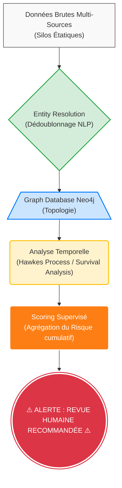

# RÉFÉRENTIEL TECHNIQUE CONTINU

Ce document a pour but d'extraire et de synthétiser toutes les exigences techniques, les architectures de données et les règles d'ingénierie qui émergent de la genèse du projet. Il complète le README et le socle mathématique en se basant sur les cas réels.

---

## 1. Modélisation de la Donnée (Cas d'usage : Affaire Lyhanna)

L'ingestion de la matière brute issue du premier échange démontre les nécessités techniques de l'ontologie du système. La base orientée graphe (Neo4j) doit pouvoir représenter la complexité suivante pour combattre les silos.

### 1.1 Entités requises (Nodes)
- **Personne** : Les individus impliqués. Le système doit gérer les homonymies partielles et les fautes de frappe ("Bob" vs "Robert").
- **Événement Judiciaire** : Plainte enregistrée, classement sans suite, enquête en cours.
- **Événement Administratif / Social** : Signalement informel, alerte d'une éducatrice, licenciement pour motif comportemental (Éducation Nationale).
- **Institution** : École, Brigade de Gendarmerie, Tribunal, Service Social.

### 1.2 Relations requises (Edges)
- `[Personne] -[:VISÉ_PAR]-> [Plainte/Signalement]`
- `[Institution] -[:ÉMET]-> [Signalement]`
- `[Personne] -[:EMPLOI_AU_SEIN_DE]-> [Institution]`
- `[Institution] -[:CLASSE_SANS_SUITE]-> [Plainte]`

### 1.3 Contraintes Systèmes (Inputs et Ingestion - Les Silos de l'État)
Le système doit être conçu pour se sur-coupler au "Labyrinthe" des bases existantes, chacune souffrant de son propre biais de spécialisation :
- **Cassiopée** (Justice) : *Système de Gestion de Procédures*. Il ignore les signaux faibles non-judiciarisés.
- **TAJ** (Traitement d'Antécédents Judiciaires) : Fichier de police/gendarmerie, massivement utilisé mais centré sur l'enquête locale.
- **FIJAISV** : Fichier des condamnés pour violences sexuelles. Inutile pour prévenir l'escalade d'un profil n'ayant jamais été condamné.
- **SALVAC / ViCLAS** (Système d'Analyse des Liens de la Violence) : Le système de rapprochement sériel de la police. Extrêmement puissant (156 items d'analyse comportementale) mais géré manuellement par un groupe restreint d'analystes, et réservé aux crimes violents majeurs.
- **La Civil Tech (Couche Zéro)** : Applications civiles gouvernementales (*App-Elles*, *Mémo de Vie*, *Ti3rs*) recensant les signaux faibles et preuves directement auprès des victimes.

Le pipeline d'ingestion (Couche A) devra donc pouvoir abstraire et standardiser des formats de données très différents, issus de ces vieux systèmes monolithiques ou des APIs modernes de la Civil Tech, en nœuds et arêtes standardisés, pour agir comme une **Super-Couche de Fusion**.

---

## 2. Extraction et Attributs de Nœuds (Enseignements du Bloc 2)

## 1. L'Architecture à 5 Couches (CGIP)

Le système CGIP est structuré selon un paradigme d'intégration globale, divisé en 5 strates étanches :
### 1.1 Data Ingestion Layer (Le défi du Continuum)

Cette couche doit résoudre les **8 Points de Rupture (Casses)** du flux d'information actuel entre l'École, la Police et la Justice :
1. **Casse #1 (École)** : Signal faible non standardisé (texte libre). Nécessite un parser NLP robuste.
2. **Casse #2 (Filtrage)** : Déperdition humaine avant même l'enquête.
3. **Casse #3 (Police)** : Silo opérationnel local.
4. **Casse #4 (Justice)** : Logique "par dossier" (Cassiopée).
5. **Casse #5 (Boucle de retour)** : Aucun retour d'information vers l'école. **(Nécessité de coder une API de notification)**.
6. **Casse #6 (Mémoire)** : Pas de timeline consolidée.
7. **Casse #7 (Identité)** : Orthographes différentes. (Résolu par la Couche 2).
8. **Casse #8 (Légalité)** : Contraintes RGPD bloquantes.

**Schéma de Flux (Le problème à résoudre) :**
```text
[École] --(Texte libre)--> [Police] --(PV)--> [Justice / Cassiopée]
   ^                                                 |
   |_________________________________________________|
            (BOUCLE DE RETOUR INEXISTANTE)
```
3. **Justice Knowledge Graph** (Neo4j)
4. **ML Risk Engine & Investigation AI** (Causalité et Prédiction)
5. **Human Decision Layer** (Alerte et XAI)

### 2.1 Taxonomie Stricte des Événements
Le système technique doit opérer une séparation binaire au niveau de la donnée ingérée :
- `is_official_judicial_procedure` (Boolean) : Ce flag technique est nécessaire pour séparer ce qui relève d'une procédure pénale stricte (Plainte, Enquête) de ce qui relève du signalement administratif (alerte école). C'est crucial pour pondérer le graphe et alimenter le moteur de compliance RGPD.

### 2.2 Propriétés (Properties) des Nœuds Événementiels
La frise chronologique extraite montre que chaque Nœud "Événement" doit posséder des métadonnées fines pour que l'inférence causale (Do-Calculus) fonctionne :
- `date` ou `timestamp` : Indispensable pour respecter la flèche du temps.
- `victim_age_at_time` (Integer) : L'âge de la victime au moment des faits est un discriminant majeur pour évaluer la récurrence ou le profilage du suspect, et pondérer la gravité de l'alerte globale.

### 2.3 Pipeline d'Ingestion NLP (LLM to Graph)
L'exercice de recoupement prouve l'efficacité de l'IA pour traiter du texte. L'architecture doit prévoir un pipeline d'ingestion textuel :
- **Composant requis** : Une brique LLM placée en amont du graphe (ex: Llama 3, Mistral).
- **Fonction** : Analyser des textes bruts ou chaotiques (rapports d'enquêtes, PV scannés) pour en extraire automatiquement :
  - Les entités (NER : Named Entity Recognition).
  - La nature des liens (Relation Extraction).
  - Les chronologies et les caractéristiques des acteurs (âges).
  Ce pipeline permet d'automatiser la création des nœuds et arêtes sans saisie manuelle laborieuse.

---

## 3. Topologie et Désambiguïsation (Enseignements du Bloc 3)

Le troisième échange démontre concrètement l'intérêt d'une base de données graphe pour structurer le chaos et éviter la fusion erronée d'événements.

### 3.1 Nœud "Dossier" (Case Node) vs Nœud "Événement"
La "Carte Mentale" montre qu'un regroupement supérieur est nécessaire.
- **Le Nœud `[Dossier_Investigation]`** : Il regroupe une série de Nœuds `[Événement]` liés à une même victime. Cela permet au GNN (Graph Neural Network) de traiter l'historique non pas comme une soupe d'événements, mais comme des sous-graphes cohérents centrés sur des faits précis.

### 3.2 Le Processus d'Entity Resolution (Dédoublonnage)
La conversation soulève le risque de confondre deux événements (l'alerte scolaire de 2020 et les viols de 2020). L'architecture devra inclure une fonctionnalité clé : **Entity Resolution**.
- Le système doit être capable de séparer deux nœuds temporels proches s'ils ne concernent pas la même victime, ou de les fusionner (Merge) avec un `Confidence Score` si de nouveaux éléments prouvent qu'il s'agit de la même affaire.

### 3.3 Visualisation Graphique (Couche H - Case Management)
L'interface utilisateur finale (le Dashboard Streamlit ou React pour les enquêteurs) devra reprendre exactement le paradigme visuel de "Carte Mentale" validé dans l'échange.
- L'enquêteur ne doit pas voir un tableau SQL. Il doit voir au centre le Nœud `[Suspect]` relié à X clusters (les victimes ou dossiers identifiés) avec une coloration distincte pour le pénal (Officiel) et le signalement (Non Officiel). L'IHM (Interface Homme-Machine) est déjà prototypée philosophiquement ici.

---

## 4. Spécifications Fonctionnelles et Systémiques (Enseignements du Bloc 4)

L'énumération de 8 failles systémiques dans l'échange fournit le cahier des charges exact des fonctionnalités mathématiques et logicielles à développer pour la plateforme.

### 4.1 Modélisation Spatiale et Contextuelle (Le Schéma ASCII)
Le diagramme "Réseau des victimes" impose d'ajouter de nouveaux types de nœuds dans Neo4j :
- **Nœuds de Contexte** : `[Milieu_Scolaire]`, `[Espace_Public]`, `[Domicile]`.
- **L'avantage mathématique (GNN)** : Relier deux victimes non pas directement entre elles, mais indirectement via un nœud "Contexte" ou "Lieu" partagé avec le suspect augmente considérablement le score de similarité cosinus (Cosine Similarity) dans l'Embedding Space du réseau de neurones, permettant à la machine de détecter un *Modus Operandi* invisible à l'œil nu.

### 4.2 L'Architecture contre les Failles (Mapping Technique)
Chaque faille soulevée appelle une réponse architecturale précise dans le code source :
1. **Silos (Faille 1)** -> Base Neo4j unifiée (Couche A).
2. **Aveuglement temporel (Faille 7)** -> Temporal Graph Networks (TGN). Le temps n'est pas une simple valeur, c'est une propriété de la relation (`[VISÉ_PAR {annee: 2020}]`) permettant d'étudier la vélocité et l'évolution d'un comportement.
3. **Sortie des radars (Faille 6)** -> Un événement classé sans suite (`status: CLOSED`) n'est jamais effacé (Soft Delete). Son poids (Weight) dans le graphe est réduit, mais il reste disponible pour de l'inférence ultérieure si un nouveau signal apparaît.
4. **Absence de profil central (Faille 4)** -> Création du Dashboard (Couche H) proposant une "Vue à 360°" agrégeant un Score de criticité hybride, indépendant de la présence ou non de casier judiciaire.
5. **Tension Présomption d'innocence vs Prévention (Faille 8)** -> C'est la justification absolue du **Moteur DPIA (Couche E)** et du **Kill-Switch (Couche F)**. L'algorithme doit bloquer ses propres déductions si elles s'apparentent à du profilage automatisé illégal.

---

## 5. Privacy by Design et Ingénierie des Poids (Enseignements du Bloc 5)

Le cinquième échange sur la tension entre prévention et libertés individuelles dicte les mécanismes de sécurité et de pondération du Graphe.

### 5.1 Gestion des "Fausses Corrélations" (Confidence Score)
Pour éviter qu'un citoyen ne soit "surclassé à risque" à tort (ex: rumeur scolaire fusionnée avec plainte ancienne), l'architecture de données doit introduire le concept mathématique de `Confidence Score` (Score de certitude).
- Chaque nœud `[Signalement]` et chaque arête `[:VISÉ_PAR]` doit comporter un attribut de `Poids` (Weight).
  - Condamnation pénale : `Weight = 1.0`
  - Plainte en cours : `Weight = 0.8`
  - Signalement administratif (École) : `Weight = 0.5`
  - Information anonyme ou rumeur : `Weight = 0.1`
- Le Graph Neural Network (GNN) doit utiliser ces poids dans sa fonction d'activation. Un amas de signaux très faibles (`0.1`) ne doit pas suffire à déclencher l'alerte maximale (Couche G).

### 5.2 Protection RGPD et "TTL" (Time-To-Live)
Pour respecter le droit à l'oubli et éviter le "profilage permanent de suspicion", le graphe ne peut pas conserver une donnée accusatoire *ad vitam æternam* avec la même force si aucune condamnation n'est prononcée.
- **Time Decay Function** : Implémentation mathématique de la décadence temporelle. Le poids d'une arête diminue de façon linéaire ou exponentielle avec le temps s'il n'y a pas de nouvelle occurrence, conformément aux durées de prescription légales.

### 5.3 Architecture Fédérée vs Datalake Monolithique
La "fragmentation institutionnelle volontaire" citée dans l'échange impose des contraintes sur le backend d'ingestion (Couche B) :
- La CGIP ne peut peut-être pas aspirer physiquement et fusionner toutes les données de la Justice et de l'École dans un même disque dur central, pour des raisons de conformité CNIL.
- **L'alternative architecturale** : Une approche de **Graphe Fédéré**. La base Neo4j de la CGIP stocke les *Index* (Pointeurs et Graphes de relations anonymisés), mais va requêter les détails via API sécurisée (avec gestion fine des droits d'accès - ACL) uniquement au moment où l'alerte est déclenchée.

---

## 6. Ingénierie Data Science et Modèles Machine Learning (Enseignements du Bloc 6)

Le sixième échange définit les 5 catégories d'algorithmes mathématiques à implémenter dans les couches d'analyse (Couches B, E et G). Le but n'est pas de "prédire une culpabilité", mais d'émettre l'alerte `REVUE HUMAINE RECOMMANDÉE`.

### 6.1 Algorithmes de Scoring (Trigger Events et Machine Learning)
- **Objectif** : Générer une alerte basée sur la vélocité et l'escalade d'une trajectoire. On ne prédit PAS "un crime" (pas de Minority Report). On estime la probabilité qu'une trajectoire d'événements s'aggrave de façon significative dans les 12 mois.
- **Formulation ML** : $y = 1$ si escalade significative, $y = 0$ sinon.
- **Architecture de la Donnée (Dataset)** : Table `person_event_window` (chaque ligne = une personne observée sur une fenêtre temporelle).
- **Feature Engineering (Le cœur du moteur ML)** :
  1. **Features Temporelles** : Fréquence, accélération, `time_decay_score`.
  2. **Features Comportementales** : Répétition du même contexte, diversité des victimes.
  3. **Features Relationnelles (Graph)** : Centralité du nœud, proximité avec des affaires graves.
  4. **Features Géographiques** : Rayon de dispersion, densité spatiale.
- **Modèles de Classification (Couche G)** : 
  - *Baseline Robuste* : Gradient Boosting (XGBoost, LightGBM) ou Random Forest. Idéal pour les données tabulaires et la calibration.
  - *SOTA (State-of-the-Art)* : Graph Neural Networks (Node2Vec, GraphSAGE) ou Temporal Transformers pour capter les trajectoires complexes.

### 6.2 Détection d'Anomalies (Anomaly Detection)
- **Objectif** : Identifier un individu au comportement statistiquement anormal (non-supervisé).
- **Algorithmes (Couche G)** : `Isolation Forest`, `One-Class SVM`, `Local Outlier Factor (LOF)`.
- **Cas d'usage** : Une concentration inhabituelle de signalements administratifs ou scolaires mineurs (non pénaux) qui sort de la norme statistique de la population.

### 6.3 Modélisation des Séquences Temporelles
- **Objectif** : Comprendre le rythme et l'escalade d'un comportement.
- **Algorithmes** : `Chaînes de Markov`, `Processus de Hawkes` (modélisation d'événements auto-excitants).
- **Cas d'usage** : Si un événement en 2017 est suivi d'une longue pause, puis de 3 événements rapides en 2026, un Processus de Hawkes modélisera cette "accélération" pour déclencher une alerte urgente.

### 6.4 Graph Analytics (Réseau)
- **Objectif** : Détecter les connexions structurelles.
- **Implémentation (Couche A / C)** : Graph Neural Networks (GNN) et algorithmes de graphe (ex: *PageRank*, *Community Detection*) appliqués sur Neo4j.
- **Cas d'usage** : Trouver le lien invisible entre deux victimes (ex: même école, même piscine) qui n'aurait pas été vu dans un tableau SQL.

### 6.5 Entity Resolution (Rapprochement de dossiers)
- **Objectif** : Dé-bruiter la base de données.
- **Implémentation (Couche B)** : Algorithmes NLP et de matching probabiliste (souvent utilisés en détection de fraude bancaire).
- **Cas d'usage** : La machine doit calculer mathématiquement si la "Mineure X" du signalement de 2026 est la même entité que la "Mineure Y" de la plainte de 2026, pour éviter de créer des doublons ou de diviser le risque par deux.

---

## 7. Predictive Risk Modeling (PRM) et Traitement du Biais (Enseignements du Bloc 7)

Le septième échange introduit des concepts issus d'exemples réels déployés à l'international, notamment l'Allegheny Family Screening Tool (AFST), imposant des gardes-fous stricts.

### 7.1 La Cascade Algorithmique (Le Pipeline)
L'échange valide la chaîne de traitement suivante, qui devient le pipeline canonique de la CGIP :
1. **Entity Resolution** : Dédoublonnage des entités.
2. **Graph Database (Neo4j)** : Restructuration sous forme de réseau.
3. **Analyse Temporelle (Hawkes Process / Survival Analysis)** : Calcul du taux d'escalade.
4. **Scoring Supervisé** : Agrégation en un score hybride.
5. **Output (Alerte Humaine)** : Le système s'arrête là et passe la main à l'humain.



### 7.2 L'Alerte et le Dashboard (L'indispensable XAI)
Le système doit être pensé pour lutter contre la "boîte noire", le biais algorithmique et le "Biais du Rétroviseur". 
- L'alerte générée doit afficher un **Risk Score**.
- **SHAP Explainability** : Le dashboard doit impérativement afficher la Feature Importance Locale justifiant l'alerte (ex: `+0.31 → fréquence événements`, `+0.22 → répétition contexte`, `-0.05 → absence antécédents graves`).
- Le statut final de l'interface doit toujours être : `Revue prioritaire recommandée`. La machine dit : "cette trajectoire ressemble statistiquement à des trajectoires à escalade", et déporte la responsabilité juridique sur le magistrat.

### 7.3 Les Modèles Alternatifs de Trajectoire (Survival Analysis)
En plus du Processus de Hawkes, l'échange suggère d'explorer l'Analyse de Survie (Survival Analysis) :
- `Cox Proportional Hazards` ou `Random Survival Forests`.
- Ces algorithmes permettent de répondre à la question : "Quelle est la probabilité qu'un nouvel événement survienne après un premier signalement dans un délai X ?". Ces modèles devront être ajoutés au backlog exploratoire du projet pour la modélisation temporelle.
