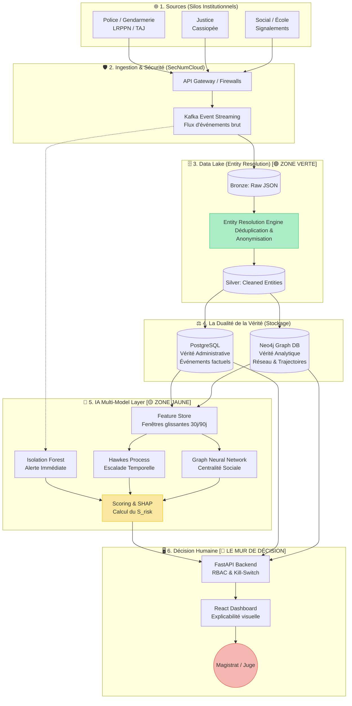

<div align="center">
  <h1>🏛️ Civic Graph Intelligence Platform (CGIP)</h1>
  <p><b>Le Cerveau Artificiel Institutionnel : Graphes Causaux, Inférence Structurelle et IA Constitutionnelle.</b></p>
  <br>
  
  
  
  
</div>

---

## 📖 TABLE DES MATIÈRES
- 🧭 **[NOUVEAU ? LISEZ LE GUIDE DE LECTURE ICI](GUIDE_DE_LECTURE.md)**
- 📖 **[CONSULTEZ LE GLOSSAIRE DE LA CGIP](GLOSSAIRE.md)**

1. [Manifeste Épistémologique : La Rupture des Silos](#1-manifeste-épistémologique--la-rupture-des-silos)
2. [L'Équilibre et l'IA Constitutionnelle](#2-léquilibre-et-lia-constitutionnelle)
3. [L'Architecture de la CGIP (Couches A à H)](#3-larchitecture-de-la-cgip-couches-a-à-h)
4. [La Modélisation Mathématique (Les 5 Algorithmes d'IA)](#4-la-modélisation-mathématique-les-5-algorithmes-dia)
5. [Modèle de Données et Ontologie (Neo4j)](#5-modèle-de-données-et-ontologie-neo4j)
6. [L'Infrastructure Distribuée (Enterprise Stack)](#6-linfrastructure-distribuée-enterprise-stack)
7. [Structure du Dépôt Open-Source](#7-structure-du-dépôt-open-source)
8. [Guide d'Installation Locale](#8-guide-dinstallation-locale)
9. [Simulation End-to-End : Démonstration Mathématique](#9-simulation-end-to-end--démonstration-mathématique)

---

## 📖 1. MANIFESTE ÉPISTÉMOLOGIQUE : LA RUPTURE DES SILOS

Le projet **Cass / CGIP (Civic Graph Intelligence Platform)** est né d'un constat implacable et systémique sur le fonctionnement de l'appareil public moderne (Justice, Police, Éducation Nationale, Services Sociaux).

### 1.1. L'Anatomie des 8 Failles Systémiques
Régulièrement, les sociétés font face à des tragédies à risques (comme l'affaire tragique que nous nommerons "Affaire L."). L'audit post-mortem de ces affaires révèle une vérité structurelle : **toutes les informations pré-existaient, mais l'administration était incapable de les relier**.

Voici comment l'information se perd mathématiquement dans le modèle français actuel :

```text
🔁 LE PARADOXE DES SILOS (Pourquoi l'administration est aveugle)

[ ÉVÉNEMENT INITIAL T=0 ]
           │
           ├─> 👩‍🏫 École (Signalement) ────────> [ Fichier ASE / Éducation ] (Silo 1)
           │
           ├─> 👮 Police (Plainte Classée) ───> [ Fichier TAJ ] (Silo 2)
           │
           └─> ⚖️ Justice (Information) ──────> [ Casier Judiciaire ] (Silo 3)

⚠️ RÉSULTAT : Le suspect n'a pas 1 profil de risque global. Il a 3 fragments de données invisibles les uns pour les autres. 
```

## 📚 Documentation Fondamentale

- **[La Genèse du Projet (PRD)](GENESE_DU_PROJET.md)** : Les 9 blocs de fondation, les failles systémiques de l'administration (Affaire L.), et la doctrine éthique.
- **[Benchmark International](BENCHMARK_INTERNATIONAL.md)** : Étude comparative des systèmes étrangers et français. Analyse des outils individuellement, versus la France, et recherche des similitudes/schémas transversaux entre pays pour prouver la nécessité technologique de la CGIP.
- **[Spécifications Techniques](FICHIER_TECHNIQUE.md)** : L'architecture de la "Machine à Détecter", les contraintes des silos (Cassiopée, FIJAISV, SALVAC) et l'intégration Civil Tech.
- **[Le Socle Mathématique](SOCLE_MATHEMATIQUE.md)** : Les équations pures (GNN, Processus de Hawkes, Time Decay, DPIA Kill-Switch) qui gouvernent le système sans boîte noire.
- **[Gap Analysis (Déperdition)](EVALUATION_DEPERDITION.md)** : Pourquoi l'approche Graphe surpasse l'approche SQL historique de l'administration.
- **[Pistes Non Explorées (Le Frigo)](PISTES_NON_EXPLOREES.md)** : Le backlog intellectuel recensant 100% des concepts théoriques évoqués mais laissés en attente.

## 🧩 L'Architecture : Civic Graph Intelligence Platform (CGIP)

La CGIP implémente une architecture à 5 couches qui ne juge rien, mais qui fusionne, détecte et priorise :



L'architecture classique souffre de **8 Points de Rupture Institutionnels** (Les "Casses") :
1. **Casse #1 (École)** : Le signal faible initial est souvent un texte libre non standardisé, inutilisable par une machine classique.
2. **Casse #2 (Filtrage Administratif)** : La priorisation humaine fait disparaître de nombreux signaux avant même la police.
3. **Casse #3 (Silo Policier)** : La police agit en "affaire locale", sans vision inter-départementale globale.
4. **Casse #4 (Silo Judiciaire)** : Cassiopée stocke par "dossier", incapable de tisser le réseau d'un individu.
5. **Casse #5 (Absence de Boucle de Retour)** : L'école ou la police qui signale n'est jamais alertée en retour de l'évolution judiciaire.
6. **Casse #6 (Mémoire Fragmentée)** : Il n'existe aucune timeline centralisée des événements pour un individu.
7. **Casse #7 (Identités Multiples)** : Les orthographes varient ("J. Dupont" vs "Jean Dupont"), empêchant la liaison des dossiers.
8. **Casse #8 (Séparation Souverain)** : Le RGPD et le Droit Pénal bloquent structurellement le croisement des données pour éviter la surveillance de masse.

### 1.2. La Réalité est un Graphe
La CGIP propose une rupture totale d'épistémologie de la donnée. La réalité à risque n'est pas une table SQL. C'est un **Graphe Orienté**.

```text
🧠 LE CHANGEMENT DE PARADIGME (Réseau de Victimes et de Contextes)

                  [ SUSPECT ]
                        │
   ┌────────────────────┼────────────────────┐
   │                    │                    │
[Milieu scolaire]   [Domicile]      [Espace public]
   │                    │                    │
Victime A          Victime B          Victime C
(Signalement)      (Plainte classée)  (Disparition)

👉 En modélisant des "Contextes" (Lieux, Écoles), la machine relie des affaires sans avoir besoin d'une connexion judiciaire explicite.
```

---

## ⚖️ 2. L'ÉQUILIBRE ET L'IA CONSTITUTIONNELLE

### 2.1. La Troisième Voie (Le Modèle Français)
Le benchmark international montre deux extrêmes :
- Le **modèle ultra-centralisé** (ex: Royaume-Uni, Danemark), redoutablement efficace pour la détection, mais critiqué pour le risque de "sur-fichage".
- Le **modèle extrêmement segmenté** (France), qui protège les libertés mais crée des angles morts.

La CGIP construit une **troisième voie** : une Architecture de Graphe Fédéré, alliée au *Privacy by Design*.

### 2.2. Le "Privacy By Design" (Confidence Score & Time Decay)
Pour éviter le cauchemar de la police prédictive ("Minority Report"), la loi est encodée directement dans les mathématiques :
1. **Le Confidence Score** : Le système pondère la gravité. (Condamnation = `1.0`, Plainte = `0.8`, Signalement École = `0.4`, Rumeur = `0.1`).
2. **Le Droit à l'Oubli (Time Decay Function)** : La force d'un lien diminue avec le temps. Un signalement vieux de 10 ans sans récidive n'a presque plus de poids.
3. **Le Kill-Switch Moteur DPIA** : Un interrupteur logiciel bloque en temps réel toute computation qui dévierait vers du profilage illégal.

> **RÈGLE D'OR JURIDIQUE : La CGIP ne prédit jamais des individus (Zone Rouge RGPD), elle détecte des trajectoires et des situations à risque (Zone Jaune). Le système fait de la *Fusion d'Information* pour générer une recommandation : `REVUE HUMAINE RECOMMANDÉE`. L'IA ne prend aucune décision légale.**

### 2.3. L'Interopérabilité vs Le Registre Centralisé (Le Hack Français)
Le vrai bloqueur souverain n'est pas technologique, c'est la **Gouvernance des données**. Dans les pays nordiques, un identifiant unique (*Personnummer*) connecte tout. En France, c'est inconstitutionnel. La CGIP utilise l'**Entity Resolution** (IA d'appariement) pour recréer virtuellement le lien entre les silos administratifs, sans jamais construire un Registre National Unique illégal.

---

## 🏗️ 3. L'ARCHITECTURE DE LA CGIP (COUCHES A À H)

### 🟦 Couche A : Le Socle Ontologique (Graph Data Foundation)
*   **Technologie** : `Neo4j` (Cypher).
*   **Rôle** : Ingestion standardisée des flux issus de bases diverses via l'introduction des `[ContextNode]` (École, Domicile).

### 🧠 Couche B : Inférence NLP & Entity Resolution
*   **Rôle** : L'**Entity Resolution** utilise les LLMs pour "dé-bruiter" la donnée et savoir si "Victime A" et "A." sont la même personne.

### 🔬 Couche D : Le Moteur Causal (Direct Acyclic Graphs)
*   **Rôle** : Remplacer la corrélation statistique par du Do-Calculus, forçant le système à vérifier le lien de causalité chronologique.

### 🛡️ Couches E & F : Moteur DPIA et Kill-Switch
*   **Rôle** : L'auto-blocage légal. Avant chaque requête GNN, si le risque d'atteinte à la vie privée est trop haut, le processus python est intercepté.

### 🔔 Couche G : Moteur d'Alerting ML
*   **Rôle** : Agrégation des scores de risque pour déclencher l'alerte finale.

### 🗂️ Couche H : Case Management System
*   **Rôle** : L'IHM pour l'enquêteur. Un graphe visuel interactif expliquant pourquoi un lien latent est suspecté (Explainable AI).

---

## 📐 4. LA MODÉLISATION MATHÉMATIQUE (LES 5 ALGOS D'IA)

Le Cerveau Central repose sur 5 tâches de Machine Learning précises :

1. **Entity Resolution (NLP)** : Dédoublonner et rapprocher les dossiers de systèmes distincts (comme en détection de fraude bancaire).
2. **Scoring de Risque (Accumulation de Signaux Faibles)** : Un *Random Forest* mesurant la récurrence spatiale et temporelle.
3. **Détection d'Anomalies (Isolation Forest)** : Repérer un profil statistiquement atypique par rapport à la population de référence.
4. **Analyse de Séquences Temporelles (Processus de Hawkes)** : Modéliser la fréquence et l'"escalade" des événements pour détecter l'urgence.
5. **Graph Analytics (GNN - PyTorch Geometric)** : Calcul du *Cosine Similarity* latent pour découvrir le chaînon manquant dans l'hyper-espace de plongement.

---

## 🧬 5. MODÈLE DE DONNÉES ET ONTOLOGIE (NEO4J)

L'ontologie du Graphe est conçue pour respecter le secret de l'instruction et le droit à la vie privée.

```graphql
type Person {
  id: ID!
  hashed_identifier: String! # Privacy by design
}

type Event {
  id: ID!
  timestamp: DateTime!
  is_official_judicial_procedure: Boolean! # Séparation Pénal / Administratif
}

type ContextNode {
  id: ID!
  type: String! # "School", "Home", "Public_Space"
}

# Relations avec Poids (Weights)
(Person)-[:VISÉ_PAR {confidence_score: 1.0, time_to_live_days: 3650}]->(Event)
(Event)-[:HAPPENED_IN]->(ContextNode)
```

---

## 🌐 6. L'INFRASTRUCTURE DISTRIBUÉE (ENTERPRISE STACK)

1. **Ingestion Streaming (Kafka)** : Absolument indispensable pour l'architecture fédérée.
2. **Graph Storage (Neo4j HA Cluster)** : Le socle de vérité.
3. **Model Registry (MLflow)** : Assure la traçabilité algorithmique et la Reproductibilité Judiciaire.
4. **Observabilité (Prometheus / Grafana)** : Expose les métriques du Kill-Switch RGPD.

## 📂 7. STRUCTURE DU DÉPÔT OPEN-SOURCE

Le projet est structuré pour accueillir du code concret (Python, ML, Graph).
```text
/
├── data/
│   ├── raw/                  # (Vide) Données brutes de simulation (strictement anonymes)
│   └── processed/            # Matrices nettoyées (ex: person_event_window.csv)
├── docs/                     # Documentation fondamentale (Genèse, Technique, Math)
├── src/
│   ├── ingestion/            # Pipelines NLP (LLM to Graph) et parsing
│   ├── graph/                # Connexion Neo4j, Cypher, Ontologie
│   ├── ml_engine/            # Modèles XGBoost, GNN, Processus de Hawkes, XAI (SHAP)
│   └── utils/                # Kill-Switch, Time Decay, RGPD constraints
├── tests/                    # Tests unitaires et E2E
├── requirements.txt          # Dépendances (Neo4j, PyTorch, XGBoost, SHAP...)
└── simulate_case.py          # Script de démonstration End-to-End
```

---

## 🛠️ 8. GUIDE D'INSTALLATION LOCALE

Si vous souhaitez contribuer ou expérimenter avec l'architecture :

1. **Cloner le dépôt et installer les dépendances** :
   ```bash
   git clone https://github.com/votre-org/cgip.git
   cd cgip
   pip install -r requirements.txt
   ```

2. **Lancer la base Neo4j (via Docker)** :
   Le moteur causal a besoin d'une base de données graphe locale pour tourner.
   *(Un fichier `docker-compose.yml` sera bientôt disponible pour instancier Neo4j avec APOC en 1 commande).*

3. **Exécuter la simulation (À venir)** :
   ```bash
   python simulate_case.py
   ```

---

## 🎬 9. SIMULATION END-TO-END : DÉMONSTRATION MATHÉMATIQUE

Le script `simulate_case.py` situé à la racine démontre le moteur en action.
Il simule une suite chronologique complexe illustrant l'incapacité humaine à faire le lien.

```text
⏳ SIMULATION CHRONOLOGIQUE GÉRÉE PAR LE MOTEUR (L'Affaire L.)

2017 ─ ⚠️ Signalement (Mineure A) → Classé sans suite
2020 ─ ⚠️ Alerte comportementale (Mineure B) → Sanction disciplinaire non judiciaire
2022 ─ ⚖️ Plainte (Victime C) → Enquête en cours
2026 ─ 🚨 Disparition d'une victime D

👉 Dans la vraie vie : 4 dossiers étanches.
👉 Dans la CGIP : Entity Resolution + Processus de Hawkes détectent l'escalade dès 2022 et lèvent une alerte critique.
```

Le simulateur va :
1. Appliquer l'usure du temps (Time Decay) sur le fait de 2017.
2. Utiliser l'**Entity Resolution** pour relier l'alerte institutionnelle de 2020 au suspect.
3. Passer la douane éthique (DPIA) sans profiler.
4. Lever l'alerte de `REVUE HUMAINE RECOMMANDÉE` au moment où la corrélation mathématique dépasse le seuil critique (en 2022), évitant le drame final.

---

> *"Le code fait loi (Lessig). Dans la CGIP, la loi fait le code."*


## Architecture de Confiance : "Architecture Souveraine"

Le système n'est pas un fichier centralisé (Big Brother), mais un **Réseau Fédéré sur Cloud Souverain**.

```text
┌────────────────────────────────────────────────────────┐
│               CLOUD SOUVERAIN (SecNumCloud)            │
├─────────────┬───────────────────┬──────────────────────┤
│ JUSTICE     │ POLICE / INTÉRIEUR│ SOCIAL / ÉDUCATION   │
│ (Niveau 0/1)│ (Niveau 1)        │ (Niveau 2)           │
└─────┬───────┴────────┬──────────┴────────┬─────────────┘
      │                │                   │
      ▼                ▼                   ▼
┌────────────────────────────────────────────────────────┐
│  SECURE DATA FABRIC & KAFKA STREAMING (Event-Driven)   │
└──────────────────────┬─────────────────────────────────┘
                       ▼
┌────────────────────────────────────────────────────────┐
│  GRAPH ENGINE (Neo4j) - Topologie et Liens Anonymisés  │
└──────────────────────┬─────────────────────────────────┘
                       ▼
┌────────────────────────────────────────────────────────┐
│  ML SANDBOX (Isolée) - Aide à la décision (Non Auto)   │
└────────────────────────────────────────────────────────┘
```
L'Intelligence Artificielle de la CGIP ne décide jamais. Elle agit dans une Sandbox isolée pour générer des signaux de priorisation humaine, basés sur le clustering et la topologie.

### Le Moteur GNN (Link Prediction)
L'Intelligence Artificielle ne score pas les individus. Son rôle principal est le **Link Prediction** : détecter les affaires isolées qui partagent une empreinte topologique (Même mode opératoire, même réseau étendu) pour suggérer des rapprochements de dossiers aux magistrats.

### Simulation Visuelle du Graphe d'Enquête

La plateforme convertit une chronologie fragmentée en un graphe dynamique :

```text
         [E1 Disparition]
                  │
                  ▼
        [E2 Ouverture enquête]
                  │
                  ▼
        [E3 Perquisition domicile]
              /                     ▼          ▼
        [L1 domicile]  [P_Suspect]
```
*(Ce graphe permet au modèle ML de repérer la concentration spatiale et l'accélération temporelle d'une crise).*

### Conformité Légale (AI Act & RGPD)
- ✅ **Human-In-The-Loop** : L'IA ne prend aucune décision judiciaire.
- ✅ **Privacy by Design** : Pseudonymisation par hachage avant tout calcul.
- ✅ **AI Act Compliant** : Classifié comme "Aide à l'enquête documentaire", aucun scoring individuel automatisé.

### L'Architecture à 6 Couches

La CGIP implémente le modèle Hybride Européen :

```text
[SOURCES (Police, Justice, Social)]
    │         │          │
    ▼         ▼          ▼
[DATA LAKE SÉCURISÉ (Cloud Souverain)]
              │
[KNOWLEDGE GRAPH (Relations & Topologie)]
              │
[ML SANDBOX (Modèles Non Décisionnels)]
              │
[LEGAL FIREWALL (Anti-IA Autonome)]
              │
[INTERFACE MAGISTRAT (Explicabilité visuelle)]
```