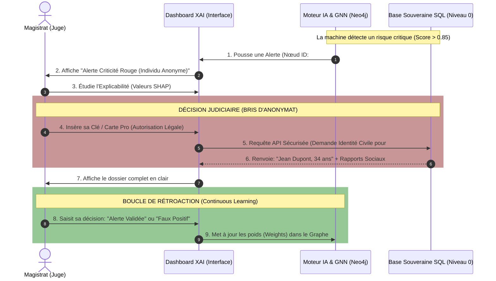

# Flux de Données : Le Magistrat (Privilège Absolu)

Ce document décrit techniquement le cycle de vie de la donnée lorsqu'elle est manipulée par le **Magistrat** (Niveau 0). L'enjeu d'ingénierie ici est de garantir que l'Intelligence Artificielle ne détient jamais l'identité réelle d'un citoyen avant qu'un juge ne l'autorise (Chiffrement Asymétrique).

## Diagramme Séquentiel du Déchiffrement Légal

Le diagramme suivant montre la séparation stricte entre le Graphe IA (Neo4j) qui manipule des empreintes mathématiques (Hash), et la Base de Données Souveraine (PostgreSQL) qui détient l'identité civile.

## Description Technique du Flux

1. **Calcul en chambre noire (Étapes 1-2)** : Le Graph Neural Network (GNN) tourne toutes les nuits. Il détecte qu'une grappe de nœuds connectée à l'ID chiffré `#A8X9` a un comportement explosif (Processus de Hawkes). Il pousse l'alerte vers l'interface web (Dashboard).
2. **Consultation XAI (Étape 3)** : Le Tableau de bord n'affiche *pas* les données brutes. Il affiche un arbre de décision explicable (SHAP) justifiant mathématiquement *pourquoi* ce nœud est dangereux.
3. **Le Bris d'Anonymat (Étapes 4-7)** : Si le Magistrat valide l'urgence de la situation, il déclenche l'API Sécurisée. C'est uniquement à cet instant (en mémoire vive, sans sauvegarde locale) que le Tableau de bord croise l'ID Haché `#A8X9` avec la Base PostgreSQL de la Justice (Couche 0) pour récupérer le vrai nom "Jean Dupont" et les rapports de l'Aide Sociale à l'Enfance (ASE).
4. **Apprentissage Continu (Étapes 8-9)** : Le clic du Magistrat ("Confirmer" ou "Rejeter") déclenche une requête Cypher (Neo4j) qui va détruire l'arête s'il s'agit d'une erreur d'homonymie, ou au contraire renforcer le Poids (Weight) de la connexion.
