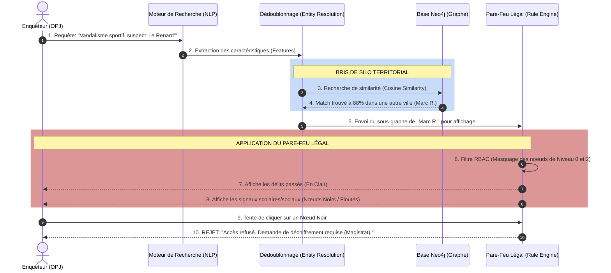

# Flux de Données : L'Enquêteur (Niveau 1)

Ce document détaille l'interaction technique entre un **Officier de Police Judiciaire (OPJ)** et le moteur de la CGIP. Le défi d'ingénierie est d'offrir une puissance de recherche ("Briser les silos") tout en implémentant un Pare-Feu Légal infranchissable (Privacy by Design) pour l'empêcher d'accéder aux données sociales ou médicales.

## Diagramme Séquentiel du Rapprochement Sériel & Pare-Feu

Le diagramme illustre le flux de dédoublonnage (Entity Resolution) et l'application automatique de la Confidentialité Différentielle (Differential Privacy) par la base de données.

## Description Technique du Flux

1. **Recherche Intelligente (Étapes 1-2)** : L'Enquêteur n'utilise pas des requêtes SQL exactes (`WHERE nom = '...'`). Il écrit une requête en langage naturel. Le moteur NLP (Natural Language Processing) traduit cela en "embeddings" (vecteurs mathématiques) pour rechercher par *concept* (Mode Opératoire).
2. **Dédoublonnage et Similarité (Étapes 3-4)** : Le modèle fouille le Graphe National et repère une signature comportementale identique dans une autre ville. Il abolit ainsi le silo territorial de la gendarmerie locale.
3. **Le Pare-Feu Légal / Privacy Layer (Étapes 5-8)** : C'est la ligne rouge absolue de l'IA Européenne (AI Act). Avant d'afficher les résultats à l'écran du policier, la "Couche de Règles" (Rule Engine) intercepte la donnée. Elle masque cryptographiquement les nœuds provenant d'une école ou d'un hôpital. L'enquêteur sait que "quelque chose" existe, mais il ne peut pas le lire. Il ne peut lire que ce qui est de son ressort (Droit Pénal).
4. **La Limite d'Enquête (Étapes 9-10)** : L'interface bloque l'action. Pour accéder à la donnée sociale, l'OPJ doit motiver sa demande légalement et déclencher le parcours de déchiffrement du Magistrat.
