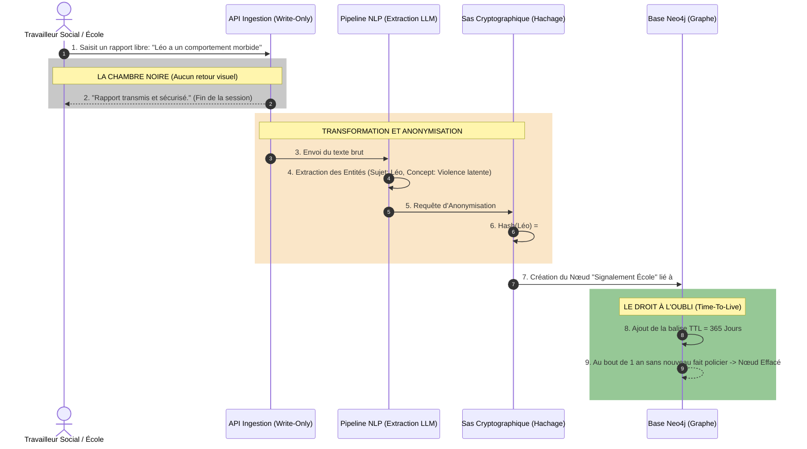

# Flux de Données : Éducation & Travailleurs Sociaux (Niveau 2)

Ce document illustre le traitement des données pour les acteurs de terrain : Directeurs d'école, Aide Sociale à l'Enfance (ASE), et personnel éducatif. 
L'ingénierie doit garantir un fonctionnement en **"Écriture Seule" (Chambre Noire)** : ils alimentent l'IA en "Signaux Faibles", mais ne peuvent jamais requêter la base pour protéger le secret de l'instruction et ne pas stigmatiser préventivement les citoyens.

## Diagramme Séquentiel de l'Ingestion Aveugle

Le diagramme montre comment le signalement est traité par le pipeline NLP (Natural Language Processing), anonymisé, puis digéré par le Graphe sans jamais renvoyer d'informations accusatoires à l'émetteur.

## Description Technique du Flux

1. **La Frappe Clavier (Étape 1)** : Le professionnel n'a pas accès à un logiciel complexe de police. Il utilise un portail sécurisé institutionnel très simple où il tape son texte en langage naturel.
2. **Fermeture de la Session (Étape 2)** : Le système est asynchrone. Dès l'envoi, la connexion est coupée. L'école ne sera jamais avertie si ce rapport a déclenché l'arrestation des parents de l'élève. C'est essentiel pour maintenir la confiance locale et la sérénité pédagogique.
3. **Le Pipeline IA (Étapes 3-4)** : Le modèle de langage (LLM) lit la phrase, comprend le contexte sémantique, et la décompose en composants graphiques (Nœuds et Arêtes).
4. **Anonymisation Légale (Étapes 5-6)** : La plateforme CGIP (qui appartient potentiellement à la Justice/Police) n'a pas le droit de détenir une base de données d'écoliers en clair. Le Sas Cryptographique transforme l'identité de l'élève en "Hash" mathématique indéchiffrable.
5. **Droit à l'Oubli Automatisé (Étapes 8-9)** : Neo4j possède une mécanique de "Time-To-Live". Si ce signalement reste isolé pendant un an, il sera automatiquement balayé de la base de données. Il n'y aura aucun "casier algorithmique" perpétuel. L'IA oublie les signaux faibles qui ne se transforment pas en délits.
