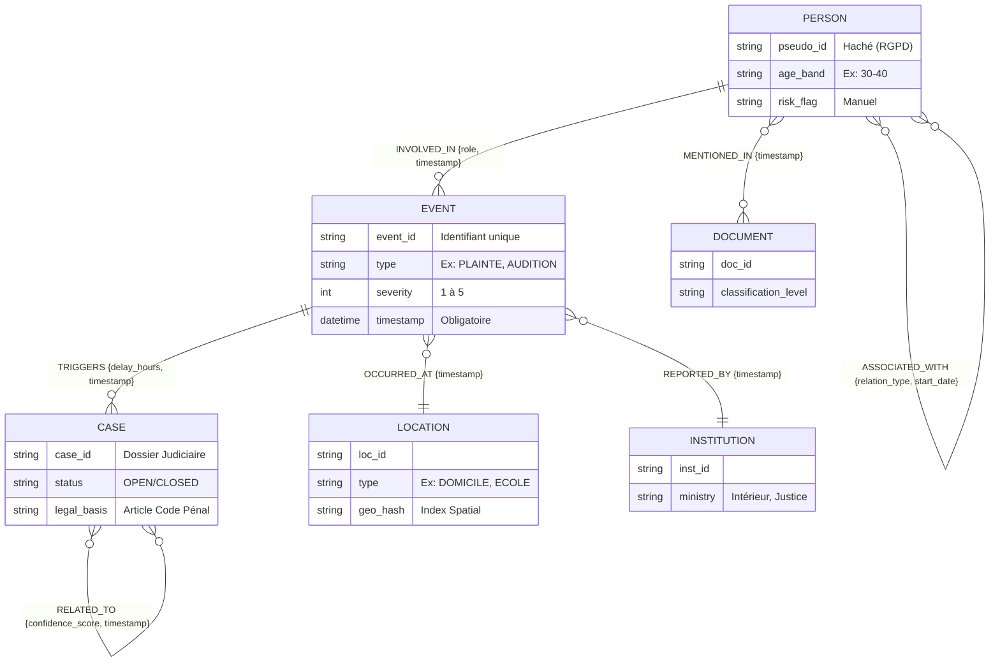

# Le Schéma Neo4j (Knowledge Graph Judiciaire)

L'implémentation de l'ontologie complète du graphe judiciaire a été poussée sur le dépôt.

## IMPORTANT : Le Paradigme du Temporal Graph (TGN)
La règle d'or architecturale est que **la temporalité est obligatoire sur toutes les arêtes**. Le modèle GNN ne verra pas qu'un simple graphe statique, il verra le graphe évoluer dans le temps. C'est le seul moyen mathématique de calculer la vélocité d'une enquête ou l'escalade d'une crise.

## Ce qui a été accompli

### 1. Le Code Cypher (Le Moteur)
Le script exécutable `neo4j_schema.cypher` contient :
- **La sécurité de la donnée (Contraintes)** : On force l'unicité des ID (`person_id`, `event_id`, `case_id`) pour éviter que le système Kafka ne duplique des nœuds en cas de désynchronisation.
- **La performance (Index)** : Des index spécifiques ont été placés sur `geo_hash` (pour calculer la proximité spatiale) et sur `timestamp` (pour l'accélération temporelle).
- **Le Pipeline d'Ingestion (MERGE)** : Les commandes d'ingestion "Upsert" (`MERGE`) que le backend Python utilisera pour injecter dynamiquement les plaintes, suspects et lieux ont été codées.

### 2. Diagramme Entité-Relation (Mermaid)
Voici la représentation visuelle de l'ontologie. Note : La temporalité est obligatoire sur TOUTES les arêtes (`timestamp` ou `start_date`), permettant l'analyse temporelle dynamique par le GNN (TGN).

